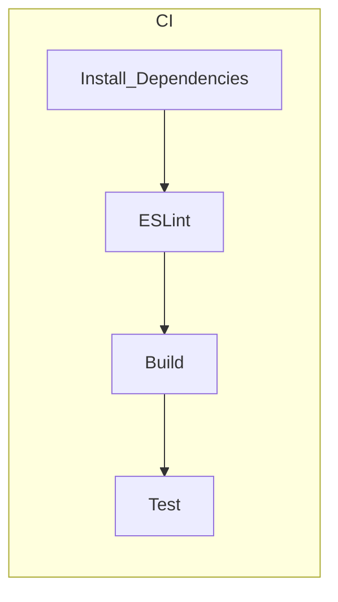

# IDS328 - Equipo 05
Team's Members:
> Simón García 1092585
>
> Jose Contreras 1095948
>
> William Abreu 1094437

## Set Up
Install all the dependencies with NPM or YARN:
```
npm install
```
```
yarn
```

## Endpoints / API
### Math_Utils
- Sum Values: GET `/sum`
```
Json Format:
{
    "values": [

    ]
}
```

## CI-CD Workflow
