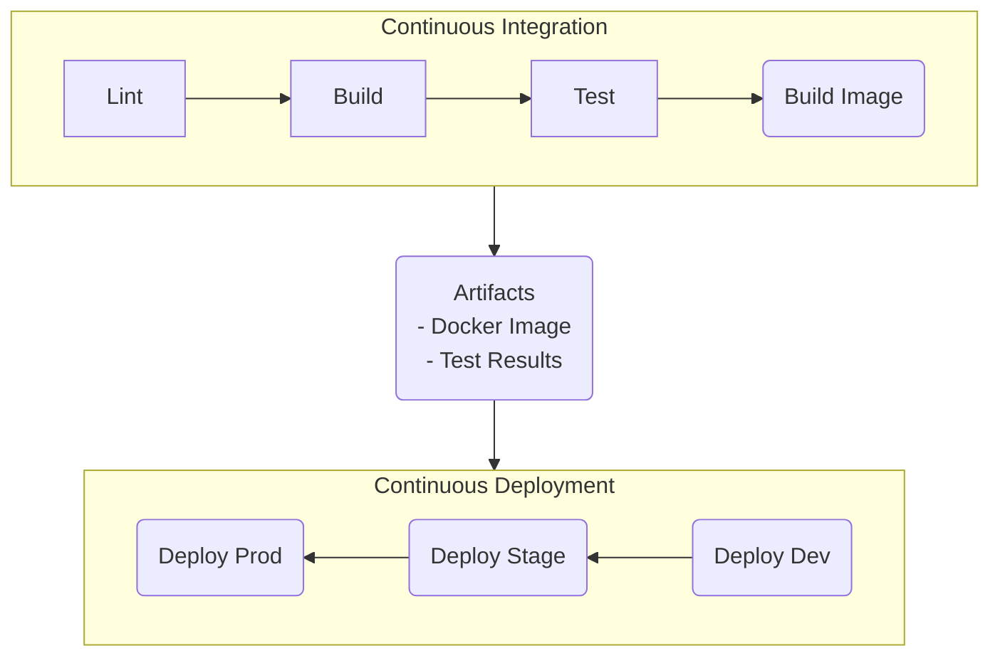

# Branching strategy

We selected the GitHub Flow branching strategy for this project. This strategy is really simple as it only contains one primary branch, which is Main, and
any other change is made in a new branch deriving from Main with the name "feature" followed by a brief description. We also decided to add devOps branches
in order to implement any changes to the documentation and configuration of the project, as well as the automation of tasks.

# Semantic Versioning
The first version is the first major release v1.0.0. After this, every version will follow the rule: Major.Minor.Patch.

If the application fix a bug, then for this Major.Minor version, increment the Patch number. Example: For the Major version 1 and Minor version 1, the first patch will be v1.1.1. So, if the application add a new feature, then increment the Minor version. And finally, if the application is incompatible with previous version, increment the Major version for the new release.

# Workflows

